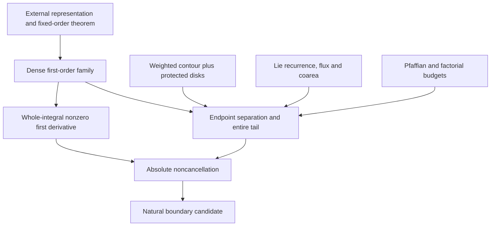

# Reading the proposed proof

Read the [manuscript](../paper/manuscript.pdf) for definitions and exact hypotheses; this guide does not replace them. Numbering is preserved from revision 8. The [W1 repair record](../provenance/W1_REPAIR_AUDIT.md) identifies the repairs already frozen in the mathematical candidate. Version 0.1-rc3 is prepared for release and not yet published. Machine-readable labels are in [LABEL_INDEX.json](../paper/LABEL_INDEX.json).

| Stage | Location | Mathematical obligation |
|---|---|---|
| Observable and measures | §2, Appendix F | Full lattice connected response; normalized double contour measure; actual inner-root residues. |
| Dense first-order family | §3, Appendix A | First even order, unique allowed cosine pair, dense family and endpoint exponential separation. |
| Whole first term | §4, Appendix B | Fixed y-only localization; legitimate residue/mean-angle deformation; equal nonzero phases; smooth complement and lower derivatives. |
| Exact decomposition | §5 | Weighted contour deformation with its actual Stokes correction, not invariance of a weighted integral. |
| Selected contour | §6 | Protected c/N parameter disk and Pfaffian/matching budget with all costs divided by N!. |
| All-branch tail | §7, Appendices D–E | Remaining-pair grouping, branch disks, microcore, corrected near-collision slope costs and scale order. |
| Mixed/compact tail | §8, Appendices D–E | Explicit current partition, lambda-deformed branch geometry, fixed real cutoffs, coarea and flux removal. |
| Entire sum | §9, Appendix C | All even orders, W1–W13 and j≤k; normal convergence and product rule; dense derivative blow-up. |

For a short independent attack, select an actual named support and check **all** parameter values in its allowed disk. Inspect the already cancelled complete pair, not its separately singular factors. At branch/endpoint degeneracies, a compactness statement needs a regular extension and a strict margin only for the claimed same-group sets; cross-group equality is allowed.

For high derivatives, follow terms generated by differentiating previously generated coefficients and cutoffs. Keep the unfactored numerator, prove flux vanishes at every stage, and use the real coarea Jacobian with phase-length/period counts. Fix the point and finite derivative order before choosing the large constants. These are central obligations, not premises granted by the guide.

For the first term, distinguish a model saddle amplitude from the entire original torus integral. The local-to-global glue is a separate proof obligation. MR1 leaves this step unresolved; the manuscript asserts it. CR0 head claims use a different point family in some runs and do not verify this manuscript's first term automatically.

The diagonal/Toeplitz papers are close methodological precedents. They do not directly supply this bulk tail bound with two global product denominators. See [prior-art matrix](../provenance/PRIOR_ART.md).
