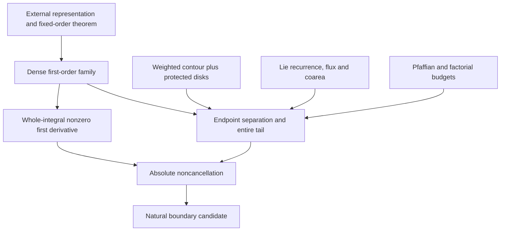

# Reading the proposed proof

**Current-status note (7 October 2026).** This guide describes the frozen manuscript v0.1-rc4. Its CR0/MR1 references are historical provenance, not the current formalization status. The internal form-factor / higher-tail proof chain is now formalized and kernel-verified in [Lean v0.2.1](../lean/README.md), with E1/E2/E3 explicit external literature premises. Independent human expert validation and peer review remain outstanding.

Read the [two-page expert brief](expert_brief.pdf) for orientation and the [frozen v0.1-rc4 manuscript](../paper/manuscript.pdf) for definitions and exact hypotheses; this guide does not replace them. The first singularity is Theorem 4.4 (p. 10), the absolute tail estimate is Theorem 9.1 (p. 25), and the noncancellation criterion and natural-boundary conclusion are Theorems 9.2–9.3 (p. 26).

Numbering refers to that manuscript. The [W1](../provenance/W1_REPAIR_AUDIT.md) and [W2](../provenance/W2_REPAIR_AUDIT.md) repair records identify the repairs already frozen in the mathematical candidate. Machine-readable labels are in [LABEL_INDEX.json](../paper/LABEL_INDEX.json).

| Stage | Location | Mathematical obligation |
|---|---|---|
| Observable and measures | §2, Appendix F | Full lattice connected response; normalized double contour measure; actual inner-root residues. |
| Dense first-order family | §3, Appendix A | First even order, unique allowed cosine pair, dense family and endpoint exponential separation. |
| Whole first term | Theorem 4.4 (§4), Appendix B | Fixed y-only localization; legitimate residue/mean-angle deformation; equal nonzero phases; smooth complement and lower derivatives. |
| Exact decomposition | §5 | Weighted contour deformation with its actual Stokes correction, not invariance of a weighted integral. |
| Selected contour | §6 | Protected c/N parameter disk and Pfaffian/matching budget with all costs divided by N!. |
| All-branch tail | §7, Appendices D–E | Remaining-pair grouping, branch disks, microcore, corrected near-collision slope costs and scale order. |
| Mixed/compact tail | §8, Appendices D–E | Explicit current partition, lambda-deformed branch geometry, fixed real cutoffs, coarea and flux removal. |
| Entire sum | §9, Appendices C and G | Theorem 9.1's absolute tail estimate; W1–W13 coverage for all higher even orders and j≤k; normal convergence, product rule and dense derivative blow-up. |

For the absolute tail, start with Appendix G's W1–W13 coverage table and trace each row to its estimate before reading the summation in Theorem 9.1. Check coverage of all higher even orders and all $0\le j\le k$, including transitions between supports and particle windows. The particle-number and current-parameter splits occur after differentiation.

For a short independent attack, select an actual named support and check **all** parameter values in its allowed disk. Inspect the already cancelled complete pair, not its separately singular factors. At branch/endpoint degeneracies, a compactness statement needs a regular extension and a strict margin only for the claimed same-group sets; cross-group equality is allowed.

For high derivatives (Appendix D, Lemmas D.1–D.2; Appendix E), follow terms generated by differentiating previously generated coefficients and cutoffs. Keep the unfactored numerator, prove flux vanishes at every stage, and use the real coarea Jacobian with phase-length/period counts. Fix the point and finite derivative order before choosing the large constants. These are central obligations, not premises granted by the guide.

For the first term, distinguish a model saddle amplitude from the entire original torus integral. The local-to-global glue is a separate proof obligation. MR1 leaves this step unresolved; the manuscript asserts it. CR0 head claims use a different point family in some runs and do not verify this manuscript's first term automatically.

The diagonal/Toeplitz papers are close methodological precedents. They do not directly supply this bulk tail bound with two global product denominators. See [prior-art matrix](../provenance/PRIOR_ART.md).

## Local rc4 W2 reading route

Read the new proof paragraphs in Lemma 7.2, then the reserved-slack transfer in Lemma 7.3 and the tau-dependent disk restrictions in Lemma 8.3. The pair bounds apply to K and named Stokes supports; the unrestricted original contour uses Proposition 5.2. Appendix D proves the changed-pair count with coupled occupancy; Appendix E fixes the constant order. The [W2 record](../provenance/W2_REPAIR_AUDIT.md) distinguishes these repairs from rc3 and from finite diagnostics.
